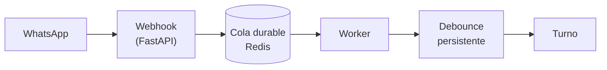
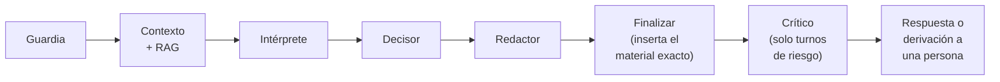
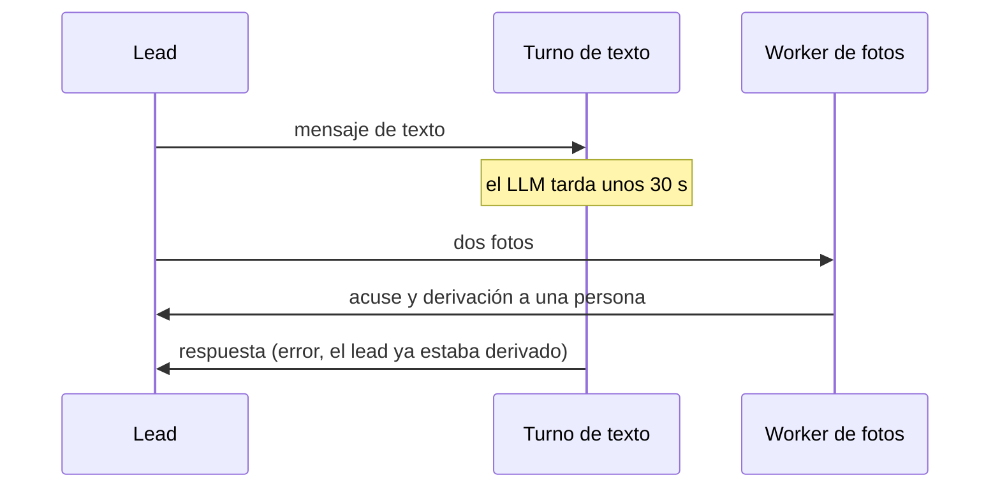

# Agente de ventas por WhatsApp para una estética

**Rol:** AI & Backend Engineer (freelance) · **Período:** ago 2026 – oct 2026
**Stack:** Python, FastAPI, LangGraph, Redis, SQLite, ChromaDB, DeepSeek, Gemini, Docker, GitHub Actions

> Proyecto de un cliente: el código es privado. Este repositorio documenta la arquitectura y las decisiones de diseño, sin datos del negocio.

## El problema

Una estética recibe, en promedio, unos 80 leads por semana por WhatsApp. Casi todos hacen las mismas preguntas: qué incluye el tratamiento, cuánto cuesta, si hay contraindicaciones. Dos reglas de negocio no admiten improvisación: **los precios se informan tal cual** y **una condición de salud no la evalúa un bot, la evalúa una persona**.

El objetivo no era reemplazar al equipo, sino llevar a cada lead por el flujo comercial (descripción, información adicional, precio, contraindicaciones) y pasárselo a una persona justo cuando corresponde.

## Qué construí

Un agente en producción sobre la API de WhatsApp Business, con 21 servicios cargados, un RAG sobre más de 120 documentos, una cola durable, despliegue automático y una suite de más de 1000 tests.

**Entrada de mensajes:** cada mensaje queda aceptado en una cola durable antes de procesarse.

**Un turno** (un subgrafo de LangGraph):

## Decisión 1: separar los roles en vez de un agente con tools

La primera versión era un único LLM con tools que decidía y escribía todo. Falló de dos maneras medibles: el modelo respondía en prosa cuando se esperaba un JSON, y el mensaje se truncaba y el turno quedaba sin texto.

Lo reemplacé por cuatro capas, cada una con una sola tarea, su propio modelo y su propia temperatura:

- **Intérprete:** clasifica la intención y normaliza el servicio contra el catálogo.
- **Decisor:** elige la acción y devuelve un JSON. Sin tools y sin RAG.
- **Redactor:** escribe el mensaje. Sin tools, con la decisión ya tomada.
- **Crítico:** segunda opinión, solo en turnos de riesgo (derivaciones, fotos, fuera de catálogo). Puede vetar una vez.

Con la temperatura del decisor en 0.0, dejó de responder en prosa en las mediciones.

## Decisión 2: el modelo decide, el sistema escribe lo que no se puede improvisar

Con una temperatura alta el modelo parafraseaba montos. En lugar de pedirle más cuidado, le saqué la tarea: precios, descripciones y contraindicaciones los inserta **el sistema, textuales, desde la base de conocimiento**, una pieza por turno. El redactor solo escribe lo que rodea al dato. Un filtro quita de su texto cualquier línea copiada del conocimiento, para que no repita lo que ya se entregó.

## Decisión 3: guardrails que no dependen del modelo

- **Gate de salud:** si se entregaron las contraindicaciones, el bot pregunta por las condiciones del lead y deriva con lo que responda.
- **Silencios por derivación:** una vez que interviene una persona, el bot calla 24 horas o 30 días, según el motivo.
- **Revisor mecánico** sobre la respuesta ya generada, con la regla "degradar, nunca bloquear": si algo falla, la respuesta sale igual en vez de dejar al lead sin contestar.

## Infraestructura: que un deploy no pierda mensajes

- **Cola durable con acuse** en Redis: un mensaje solo se descarta cuando el handler terminó. Al arrancar, se recupera lo que quedó en vuelo.
- **Debounce persistente:** agrupa los mensajes seguidos de un lead y sobrevive a los reinicios.
- **Idempotencia** por `message_id` y apagado ordenado, que drena la cola antes de morir.

## Un bug de producción que me enseñó sobre concurrencia

Un lead mandó un texto y, segundos después, dos fotos. El camino de las fotos corre en un bucle y los turnos de texto en otro. Las fotos derivaron al lead a una persona mientras el turno de texto seguía en el LLM, y cuando terminó **le mandó la respuesta a un lead que ya estaba con el equipo**.

Lo encontré leyendo los logs de producción. La solución fue chequear el estado cuando vuelve el grafo: si el lead pasó a una persona durante el turno, la respuesta se descarta. El mismo patrón resolvió otro caso: si el lead escribe *mientras* el bot está respondiendo, esa respuesta ya contesta a medias. Ahora se descarta, los mensajes se juntan y se contesta una sola vez a todo (con un tope de reintentos para que un lead que escribe sin parar no deje el turno en bucle).

## Cómo sé que funciona

- **Los tests nunca llaman a terceros.** Una guarda de red falla cualquier pedido externo. Al agregarla encontré cinco tests que sí lo hacían, incluidos cuatro que descargaban media con el token real de WhatsApp.
- **Sin asserts sobre texto generado por un LLM**: no son confiables. La calidad conversacional se mide con una batería de conversaciones con el LLM real, que leo a mano.
- **RAG evaluado** contra un golden set de 83 preguntas.
- **CI sin tests deshabilitados.** Una lista de `--deselect` había llegado a 25 tests y silenciaba fallos reales; ahora un test que falla se arregla o se borra.
- **Un test del contrato de variables de producción** que lee el workflow, el script de deploy y el compose. Lo escribí porque una variable de infraestructura sobrevivió semanas en las cuatro capas sin que nadie la leyera.

## Entrega y operación

GitHub Actions corre los tests en cada PR y despliega solo cuando `main` queda en verde: los secretos viven en un gestor, el deploy hace health check y smoke test, y **vuelve solo a la versión anterior si fallan**. Cada turno deja una traza en LangSmith y eventos estructurados con identificadores de correlación, más el costo de tokens por conversación.

## Contacto

Tomás Barrera · [LinkedIn](https://www.linkedin.com/in/tomastb/) · [Portfolio](https://landing-barreratomas-projects.vercel.app/)
